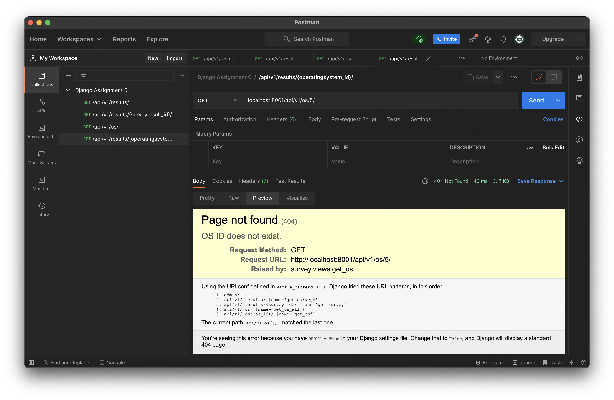

# Backend Assignment 0

와플스튜디오 19.5기 루키 Backend 세미나 0 [과제](https://github.com/wafflestudio/19.5-rookies/tree/master/django/seminar0/assignment0)

---

1. [assignment0](./assignment0)에 포함된 waffle_backend 서버를 자신의 로컬 환경을 잘 갖춰 동작 시키는 데에 성공시켜야 합니다. `python manage.py
runserver`를 통해 서버가 실행된 화면이 포함된 스크린샷을 `/results`에 적절한 이름으로 포함시켜 주세요. 4. 이후 정도까지는 진행하신 후에야
서버를 완전히 정상 동작시킬 수 있을 것이고, 스크린샷도 이때 이후로 부탁드립니다. 참고로 터미널 등의 콘솔에 `runserver`를 시킨 직후의 화면 정도면 충분합니다.

2. 로컬 환경에 Python을 설치하고, Python 3.8.X이며 waffle_backend만을 위한 '가상환경'을 activate 시킨 상태로
[requirements.txt](./assignment0/requirements.txt) 의 패키지들을 설치해야 합니다. 가상환경을 activate 시킨 것을 확인할 수 있고,
`pip list` 등을 통해 설치된 패키지와 버전을 확인할 수 있는 스크린샷들을 `/results`에 적절한 이름으로 포함시켜 주세요.
그리고 (사후 추가된 부분이라 필수는 아니지만) 가급적 `python --version` 등을 통해 Python 버전을 확인하는 과정도 포함되어 있다면 좋겠습니다.
```bash
$ python3 -m virtualenv venv
$ source venv/bin/activate
(venv) $ pip3 install -r requirements.txt
```
M1 맥북에서는 추후 단계에서의 문제를 방지하기 위해 최대한 Apple Silicon 지원이 되는 Python 버전을 이용하는 것이 좋다. 물론 그럼에도 MySQLclient 설치 시 `ld: library not found for -lzstd`와 같은 오류가 발생한다. 이때는 아래와 같이 실행해주면 해결된다. ~~아직 이부분은 이해못함~~
```bash
$ brew install zstd
(venv) $ FLAGS="-I$(brew --prefix)/include" LDFLAGS="-L$(brew --prefix)/lib" pip3 install mysqlclient==2.0.1
```


3. 로컬 환경에 MySQL을 설치하여 waffle_backend의 [settings.py](./assignment0/waffle_backend/settings.py) 에 명시된 DATABASES 설정대로 서버가 DB와 연결을 맺도록 해야합니다.
이 과정을 통해 로컬 MySQL에 올바른 password를 가진 user, database를 생성하고 user가 해당 database에 대한 권한(privileges)을 갖도록 할 것입니다.
가급적 MySQL CLI의 명령어를 통해 이를 진행하시기 바랍니다.
```bash
$ mysql.server start
$ mysql -u root

mysql> USE mysql;
mysql> CREATE USER 'waffle-backend'@'localhost' IDENTIFIED BY 'seminar';
mysql> CREATE DATABASE waffle_backend default CHARACTER SET UTF8;
mysql> GRANT ALL PRIVILEGES ON waffle_backend.* TO 'waffle-backend'@'localhost';
mysql> FLUSH PRIVILEGES;
```

4. 자신의 로컬 DB에 [migration](https://docs.djangoproject.com/en/3.1/topics/migrations/) 을 완료해야 합니다.
이 과정을 통해 database에 table들이 추가됩니다. Django migration을 이용해 table을 추가하는 과정임을 확인하세요.

```bash
(venv) $ python3 manage.py migrate
(venv) $ python3 manage.py runserver
```
M1 맥북을 사용할 때 Apple Silicon 지원이 안되는 Python 버전을 이용하면, migration 진행 시에 `NameError: name '_mysql' is not defined`와 같은 에러가 발생할 것이다.
이럴 경우 PyMySQL 라이브러리를 사용하여 문제를 해결할 수 있다. 아래 코드를 `settings.py`에 추가해주면 된다.
```python
import pymysql
pymysql.install_as_MySQLdb()
```


5. 이미 준비된 download_survey [command](https://docs.djangoproject.com/en/3.1/howto/custom-management-commands/) 를 이용해
[예시 데이터](./assignment0/example_surveyresult.tsv)를 survey_surveyresult 테이블에 저장시켜야 합니다. 예시 데이터는 실제 여러분이 참여해주신 설문 결과이며,
애초에 익명이긴 하지만 사적인 내용이 포함되었을 수 있는 주관식 응답은 모두 제외했습니다. `python manage.py help`를 이용해 manage.py 를 통해 실행할 수 있는 command들을 확인할 수 있습니다.
기본 command들 외에, 제가 미리 추가해둔 `download_survey`를 확인할 수 있을 것입니다.
이 과정을 통해 database의 `survey_surveyresult`, `survey_operatingsystem` table에 row들을 insert하게 됩니다. Django command를 이용해 row를 추가하는 과정임을 확인하세요.
```bash
(venv) $ python3 manage.py download_survey
```

6. 앞선 3.~5.의 과정을 통해 로컬 MySQL에 database와 table, 그리고 row들이 잘 포함되었는지 확인하는 과정을 가져야할 것입니다.
두 가지 방식을 통해 직접 DBMS를 이용해 해당 내용을 조회하도록 하겠습니다. 먼저 MySQL CLI를 실행시켜서 MySQL CLI의 명령어들을 이용해, waffle_backend 서버의
database를 선택하고 해당 database에 속한 table들을 출력하세요. 그리고 `survey_surveyresult`, `survey_operatingsystem` table의 모든 row의
모든 column을 출력하세요. 이 과정이 포함된 스크린샷 또는 콘솔 로그를 `/results`에 적절한 이름으로 포함시켜 주세요. 이제 MySQL Workbench, DataGrip 등 Database GUI
툴을 이용해 마찬가지로 `survey_surveyresult`, `survey_operatingsystem` table의 모든 row의 모든 column을 출력하세요. 이 과정이 포함된 스크린샷 또는 콘솔 로그를 `/results`에 포함시켜 주세요.
<!--


-->

```bash
$ mysql -u root

mysql> USE waffle_backend;
Reading table information for completion of table and column names
You can turn off this feature to get a quicker startup with -A

Database changed
mysql> SHOW TABLES;
+----------------------------+
| Tables_in_waffle_backend   |
+----------------------------+
| auth_group                 |
| auth_group_permissions     |
| auth_permission            |
| auth_user                  |
| auth_user_groups           |
| auth_user_user_permissions |
| django_admin_log           |
| django_content_type        |
| django_migrations          |
| django_session             |
| survey_operatingsystem     |
| survey_surveyresult        |
+----------------------------+
12 rows in set (0.00 sec)

mysql> SELECT * FROM survey_surveyresult;
+----+--------+-----+-------------+--------- ---------+----------------+----------------+---------------+---------------+----------------------------+-------+
| id | python | rdb | programming | major             | grade          | backend_reason | waffle_reason | say_something | timestamp                  | os_id |
+----+--------+-----+-------------+-------------------+----------------+----------------+---------------+---------------+----------------------------+-------+
|  1 |      1 |   1 |           1 | 타 전공             | 3학년           |                |               |               | 2021-08-26 21:25:32.000000 |     2 |
|  2 |      3 |   1 |           3 | 컴퓨터공학부 주전공    | 1학년           |                |               |               | 2021-08-26 21:27:40.000000 |     2 |
|  3 |      3 |   1 |           2 | 컴퓨터공학부 주전공    | 2학년           |                |               |               | 2021-08-26 21:27:44.000000 |     2 |

...

| 65 |      3 |   3 |           3 | 타 전공             | 4학년 이상       |                |               |               | 2021-08-28 01:00:25.000000 |     1 |
| 66 |      4 |   2 |           3 | 타 전공             | 2학년           |                |               |               | 2021-08-28 01:44:15.000000 |     2 |
| 67 |      3 |   2 |           2 | 타 전공             | 4학년 이상       |                |               |               | 2021-08-28 02:03:23.000000 |     1 |
+----+--------+-----+-------------+-------------------+----------------+----------------+---------------+---------------+----------------------------+-------+
67 rows in set (0.00 sec)

mysql> SELECT * FROM survey_operatingsystem;
+----+----------------+-----------------------------------------+--------+
| id | name           | description                             | price  |
+----+----------------+-----------------------------------------+--------+
|  1 | Windows        | Most favorite OS in South Korea         | 200000 |
|  2 | MacOS          | Most favorite OS of Seminar Instructors | 300000 |
|  3 | Linux          | Linus Benedict Torvalds                 |      0 |
|  4 | Ubuntu (Linux) |                                         |   NULL |
+----+----------------+-----------------------------------------+--------+
4 rows in set (0.00 sec)
```


7. waffle_backend 서버를 `8001` port로 실행한 후, Postman을 통해 `GET /api/v1/results/`와 `GET /api/v1/results/{surveyresult_id}/`를
호출하고 그 결과가 보이는 화면이 포함된 스크린샷을 `/results`에 적절한 이름으로 포함시켜 주세요.
```bash
(venv) $ python3 manage.py runserver 8001
```


8. [views.py](./assignment0/survey/views.py) 와 [urls.py](./assignment0/survey/urls.py) 를 수정하여 `GET /api/v1/os/`와
`GET /api/v1/os/{operatingsystem_id}/`를 개발하세요. 이미 [serializers.py](../assignment0/survey/serializers.py)
에 `serialize_survey_result`, `serialize_os`를 정의해두었기에 response 형식에 대해 고민할 필요는 없습니다.
`GET /api/v1/os/`는 DB의 모든 `survey_operatingsystem`을 클라이언트/프론트엔드에게 전달하는 API입니다. `GET /api/v1/os/{operatingsystem_id}/`는
같은 table에서 `operatingsystem_id`에 해당하는 primary key를 가진 row의 정보만 전달하는 API입니다. 두 API의 status code는 정상적인 경우 `200 OK`로 해주세요.
여기까지 개발한 내용을 아래 '제출 방식'에서 설명하는 repository에 `assignment0` directory로 포함시켜 주세요. 또한 개발한 두 API 역시 7.에서처럼 Postman을
통해 확인한 후 해당 스크린샷을 `/results`에 적절한 이름으로 포함시켜 주세요.
```python
def get_os_all(request):
    if request.method == 'GET':
        os_all = list(map(lambda os: serialize_os(os), OperatingSystem.objects.all()))
        return JsonResponse({"os": os_all}, status=200)
    else:
        return HttpResponseNotAllowed(['GET', ])

def get_os(request, os_id):
    if request.method == 'GET':
        try:
            survey = OperatingSystem.objects.get(id=os_id)
            return JsonResponse(serialize_os(survey), status=200)
        except:
            return Http404("OS ID does not exist.")
    else:
        return HttpResponseNotAllowed(['GET', ])
```


9. `GET /api/v1/os/{operatingsystem_id}/`를 개발할 때, `django.shortcuts`의 `get_object_or_404`를 사용하지 마세요.
직접 [get()](https://docs.djangoproject.com/en/3.1/ref/models/querysets/#get) 을 이용하고, 해당 id의 row가 존재하지 않는 경우 발생하는
Exception을 처리해 이 경우 별도의 data 없이 response의 status code가 `404 NOT FOUND`가 되도록 하세요. 일부러 존재하지 않는 id에 대해 Postman으로
API call을 하고, 그 결과에 대한 스크린샷 역시 `/results`에 적절한 이름으로 포함시켜 주세요.



10. 이미 개발된 `GET /api/v1/results/`에 `os`라는 query params를 넣어 원하는 결과만 뽑을 수 있도록 변경해주세요. 예를 들어
    `GET /api/v1/results/?os=Windows` 라는 request를 날리는 경우 os가 윈도우라고 응답한 설문결과만을 반환해야 합니다. `os`에 들어갈 수 있는
    것은 'Windows', 'MacOS', 'Linux' 이며 다른 입력이 들어올 경우 response의 status code는 `400 Bad Request`를 반환해야 합니다.
```python
def get_survey_results(request):
    if request.method == 'GET':
        params = request.GET.get('os')
        if params:
            try:
                survey_results = list(map(lambda result: serialize_survey_result(result), OperatingSystem.objects.get(name=params).surveys.all()))
            except OperatingSystem.DoesNotExist:
                return HttpResponseBadRequest("OS does not exist.")
        else:
            survey_results = list(map(lambda result: serialize_survey_result(result), SurveyResult.objects.all()))
        return JsonResponse({"surveys": survey_results}, status=200)
    else:
        return HttpResponseNotAllowed(['GET', ])
```


11. `waffle-rookies-19.5-backend-0`의 `README.md`에 과제 관련 하고 싶은 말, 어려웠던 점 등을 남겨주세요. 물론 적극적으로 해결되어야 할 피드백이나
질문 사항은 [Issues](https://github.com/wafflestudio/19.5-rookies/issues) 등을 이용해주세요!