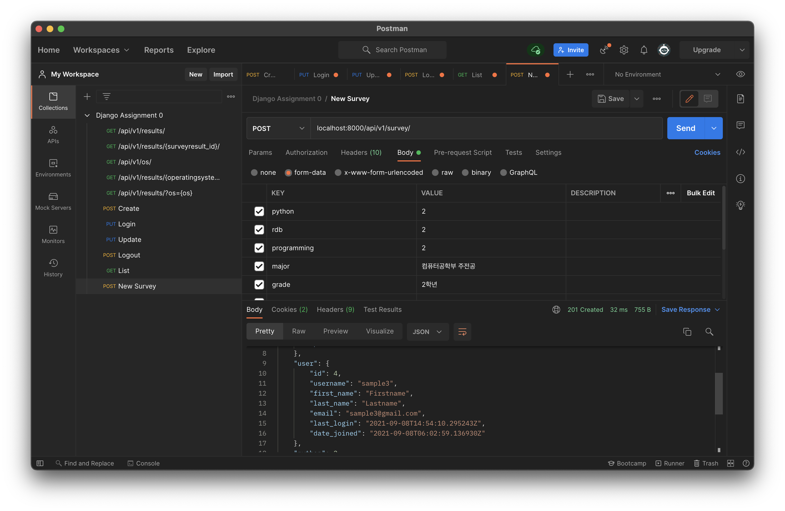

# Django Assignment 1

와플스튜디오 19.5기 루키 Django 세미나 1 [과제](https://github.com/wafflestudio/19.5-rookies/tree/master/django/seminar1/assignment1)

---


1. `survey_surveyresult` table에 `user_id` column을 추가하세요. 이미 `survey_surveyresult`에 `user_id`가 없는 데이터들이 들어가있으므로,
`user_id`는 당연히 nullable해야 하며, 연결되어있는 user row가 삭제된다고 해도 survey_surveyresult의 해당 row까지 같이 삭제되면 안 됩니다.
해당 `ForeignKey`의 `related_name`은 `'surveys'`로 지정해주세요.(related_name이 무엇인지는 한 번씩 따로 찾아보시고 이해하려 노력하시면 좋겠습니다.)
덧붙여, `CharField`들엔 1번째 세미나에서 언급했듯 모두 `blank`만 `True`로 설정하시고, `timestamp`에는 이후 이 table의 row가 추가될 때마다 그 시점을 나타내는 값이
자동으로 들어가도록 관련 변경을 포함하시기 바랍니다. 이 조건들을 모두 충족하는 migration 파일이 하나로 이뤄져야 합니다.
migrate가 정상적으로 완료되었다면 Django `showmigrations` 명령어를 통해 console에 출력한 결과와 원하는 도구를 이용해
MySQL에 직접 `desc survey_surveyresult;`를 실행한 결과의 텍스트 또는 스크린샷을 `/results`에 적절한 이름으로 포함시켜 주세요.
절대 DB에 직접 query를 실행해 column을 추가 또는 수정하지 말고, Django의 해당 model을
수정해 migration 파일을 생성하여 이를 적용시키는 방식으로 진행하세요. 만일, migration 파일을 잘못 추가하기만 한 경우에는 그냥 해당 Python 파일을 삭제하고 다시 생성하면 됩니다.
하지만 이미 DB에 migrate까지 진행했다면, 다시 model을 수정하여 또 새로운 migration 파일을 생성하지 말고, 잘못 진행했던 migrate를 Django 명령어를 이용해
기존 상태로 되돌린 후 해당 migration 파일을 삭제하고 진행하세요.

`survey/models.py`의 `SurveyResult` 모델을 다음과 같이 변형하였다.
```python
class SurveyResult(models.Model):
    EXPERIENCE_DEGREE = (
        (1, 'very low'),
        (2, 'low'),
        (3, 'middle'),
        (4, 'high'),
        (5, 'very_high'),
    )

    os = models.ForeignKey(OperatingSystem, null=True, related_name='surveys', on_delete=models.SET_NULL)
    user = models.ForeignKey(User, null=True, related_name='surveys', on_delete=models.SET_NULL)
    python = models.PositiveSmallIntegerField(choices=EXPERIENCE_DEGREE)
    rdb = models.PositiveSmallIntegerField(choices=EXPERIENCE_DEGREE)
    programming = models.PositiveSmallIntegerField(choices=EXPERIENCE_DEGREE)
    major = models.CharField(max_length=100, blank=True)
    grade = models.CharField(max_length=20, blank=True)
    backend_reason = models.CharField(max_length=500, blank=True)
    waffle_reason = models.CharField(max_length=500, blank=True)
    say_something = models.CharField(max_length=500, blank=True)
    timestamp = models.DateTimeField(auto_now_add=True)
```
이후 migration을 진행한 결과 다음과 같이 나타났다.
```bash
(venv) $ python3 manage.py migrate
(venv) $ python3 manage.py showmigrations
admin
 [X] 0001_initial
 [X] 0002_logentry_remove_auto_add
 [X] 0003_logentry_add_action_flag_choices
auth
 [X] 0001_initial
 [X] 0002_alter_permission_name_max_length
 [X] 0003_alter_user_email_max_length
 [X] 0004_alter_user_username_opts
 [X] 0005_alter_user_last_login_null
 [X] 0006_require_contenttypes_0002
 [X] 0007_alter_validators_add_error_messages
 [X] 0008_alter_user_username_max_length
 [X] 0009_alter_user_last_name_max_length
 [X] 0010_alter_group_name_max_length
 [X] 0011_update_proxy_permissions
 [X] 0012_alter_user_first_name_max_length
contenttypes
 [X] 0001_initial
 [X] 0002_remove_content_type_name
sessions
 [X] 0001_initial
survey
 [X] 0001_initial
 [X] 0002_auto_20210907_1713
user
 (no migrations)
```
```mysql
mysql> desc survey_surveyresult;
+----------------+-------------------+------+-----+---------+----------------+
| Field          | Type              | Null | Key | Default | Extra          |
+----------------+-------------------+------+-----+---------+----------------+
| id             | int               | NO   | PRI | NULL    | auto_increment |
| python         | smallint unsigned | NO   |     | NULL    |                |
| rdb            | smallint unsigned | NO   |     | NULL    |                |
| programming    | smallint unsigned | NO   |     | NULL    |                |
| major          | varchar(100)      | NO   |     | NULL    |                |
| grade          | varchar(20)       | NO   |     | NULL    |                |
| backend_reason | varchar(500)      | NO   |     | NULL    |                |
| waffle_reason  | varchar(500)      | NO   |     | NULL    |                |
| say_something  | varchar(500)      | NO   |     | NULL    |                |
| timestamp      | datetime(6)       | NO   |     | NULL    |                |
| os_id          | int               | YES  | MUL | NULL    |                |
| user_id        | int               | YES  | MUL | NULL    |                |
+----------------+-------------------+------+-----+---------+----------------+
12 rows in set (0.00 sec)
```

2. 이미 정의되어 있는 `POST /api/v1/user/`와 `PUT /api/v1/user/`를 이용해 Postman으로 User의 회원가입과 로그인을 각각 진행하고 해당
request, response가 모두 보이는 스크린샷을 `/results`에 적절한 이름으로 포함시켜 주세요. 회원가입과 로그인 API 모두 내부적으로 Django `login()`을
포함하고 있기에, 두 API 중 어떤 것이라도 정상 처리되는 시점에 [Django CSRF 문서](https://docs.djangoproject.com/en/3.2/ref/csrf/#how-it-works)에도 나와있듯
csrftoken이 변경되어 이를 신경 써야함을 알 수 있습니다. 이후 POST, PUT, DELETE 같은 method의 API 요청이 동작하지 못하면 이를 고려해야하는 것을 잊지마세요.
(관련 작년 이슈 [#105 issue](https://github.com/wafflestudio/rookies/issues/105) 참고)


3. 회원가입이 정상적으로 이뤄졌다면 당연히 MySQL에서도 이를 직접 확인할 수 있어야할 것입니다. 세 명 이상의 유저를 API로 회원가입시킨 후,
원하는 도구로 직접 DB를 조회해 모든 user들의 id, last_login, username, first_name, last_name, email, is_active, date_joined에 해당하는 column의 데이터만을 뽑아
텍스트 또는 스크린샷을 `/results`에 적절한 이름으로 포함시켜 주세요.
```mysql
mysql> select id, last_login, username, first_name, last_name, email, is_active, date_joined from auth_user;
+----+----------------------------+----------+------------+-----------+----------------------+-----------+----------------------------+
| id | last_login                 | username | first_name | last_name | email                | is_active | date_joined                |
+----+----------------------------+----------+------------+-----------+----------------------+-----------+----------------------------+
|  1 | 2021-09-08 03:58:30.889633 | xxnpark  |            |           | jaejae1112@gmail.com |         1 | 2021-09-08 03:49:32.157781 |
|  2 | 2021-09-08 04:15:11.990620 | sample1  |            |           | sample1@gmail.com    |         1 | 2021-09-08 04:15:11.921583 |
|  3 | 2021-09-08 04:16:19.553634 | sample2  |            |           | sample2@gmail.com    |         1 | 2021-09-08 04:16:19.483613 |
+----+----------------------------+----------+------------+-----------+----------------------+-----------+----------------------------+
3 rows in set (0.01 sec)
```

4. 현재 이 서버는 회원가입 시에 first_name과 last_name에 해당하는 정보를 받을 수 없습니다. `POST /api/v1/user/`를 수정하여, first_name과 last_name을
request의 body로부터 받아 `auth_user` table에 새로운 row insert 시점에 함께 포함될 수 있도록 하세요.
first_name과 last_name 모두가 request의 body에 없다면(key 자체가 없거나, 있어도 빈 str) 기존처럼 회원가입시키면 됩니다.
하지만 둘 중 하나만 존재하거나, 둘 중 어느 것에라도 숫자가 포함되어 있다면 `400 BAD REQUEST`가 되어야 합니다. first_name, last_name을 포함해 회원가입하는 경우와,
400이 발생하는 회원가입 두 경우를 모두 Postman에서 진행하고 해당 스크린샷을 `/results`에 적절한 이름으로 포함시켜 주세요. 물론 username, email, password는 항상 필수 조건입니다.
response에 이용되는 UserSerializer 역시 수정하여 first_name, last_name의 정보도 포함해 response로 전달하는 것을 잊지마세요.

`user/views.py`의 `UserViewSet` set 안의 `POST /api/v1/user/` 부분을 다음과 같이 변경하였다.
```python
class UserViewSet(viewsets.GenericViewSet):
    
    '''
    중략
    '''
    
    # POST /api/v1/user/ : 회원가입 및 초기 로그인
    def create(self, request, *args, **kwargs):
        username = request.data.get('username')
        first_name = request.data.get('first_name')
        last_name = request.data.get('last_name')
        email = request.data.get('email')
        password = request.data.get('password')
    
        if not username or not email or not password or first_name and not last_name or not first_name and last_name or any(c.isdigit() for c in first_name) or any(c.isdigit() for c in last_name):
            return Response(status=status.HTTP_400_BAD_REQUEST)
    
        try:
            # Django 내부에 기본으로 정의된 User에 대해서는 create가 아닌 create_user를 사용
            # password가 자동으로 암호화되어 저장됨. database를 직접 조회해도 알 수 없는 형태로 저장됨.
            user = User.objects.create_user(username, email, password, first_name=first_name, last_name=last_name)
        except IntegrityError:  # 중복된 username
            return Response(status=status.HTTP_409_CONFLICT)
    
        # 가입했으니 바로 로그인 시켜주기
        login(request, user)
        # login을 하면 Response의 Cookies에 csrftoken이 발급됨
        # 이후 요청을 보낼 때 이 csrftoken을 Headers의 X-CSRFToken의 값으로 사용해야 POST, PUT 등의 method 사용 가능
        return Response(self.get_serializer(user).data, status=status.HTTP_201_CREATED)
```


5. 4.에서처럼 신규 회원가입 유저만 first_name, last_name 정보를 가질 수 있게 개발하면 기존 유저들의 항의가 있을 수 있을 것입니다. 이를 해결하기 위해 `PUT /api/v1/user/` API를
새로 개발하고, 이미 가입한 유저들이 해당 API를 이용해 first_name, last_name, 그리고 username을 수정할 수 있도록 하세요. username만 수정할 수도 있고,
first_name과 last_name만 수정할 수도 있고, 셋 다 동시에 수정할 수도 있습니다. 하지만 회원가입 때처럼 first_name, last_name 둘 중 하나만
변경 요청에 포함되거나, 둘 중 어느 것에라도 숫자가 포함되어 있다면 `400 BAD REQUEST`가 되어야 합니다. 로그인하지 않은 유저가 해당 API를 요청하면 `403 FORBIDDEN`처리해야 합니다.
username은 `desc auth_user;`를 MySQL에 실행해보면 알 수 있듯, unique 조건이 있습니다. 때문에 DB에 존재하던 username으로 바꾸려는 request는
아무 처리가 없으면 `500 INTERNAL SERVER ERROR`가 발생할 것입니다. 그런 경우가 발생하지 않도록 `409 CONFLICT` 처리하세요.
이 API에 대해서는 물론 Postman 등으로 개발 과정에서 꾸준히 테스트하시되, 스크린샷을 포함시킬지는 자유이며 코드에 모든 내용을 반영하면 됩니다.
response는 정상 처리되는 경우에만 `200 OK`와 함께 로그인 API의 body와 동일하게 처리하면 됩니다.

`user/views.py`의 `UserViewSet` set에 `PUT /api/v1/user/`에 해당하는 API를 개발하였다.
```python
class UserViewSet(viewsets.GenericViewSet):
    
    '''
    중략
    '''
    
    # PUT /api/v1/user/ : 로그인한 유저의 회원정보 수정
    def put(self, request):
        username = request.data.get('username')
        first_name = request.data.get('first_name')
        last_name = request.data.get('last_name')

        if first_name and not last_name or not first_name and last_name or any(c.isdigit() for c in first_name) or any(c.isdigit() for c in last_name):
            return Response(status=status.HTTP_400_BAD_REQUEST)

        user = request.user

        if not user.is_authenticated:  # 로그인되어있지 않은 경우
            return Response(status=status.HTTP_403_FORBIDDEN)

        try:
            if username:
                user.username = username
            if first_name:
                user.first_name = first_name
            if last_name:
                user.last_name = last_name
            user.save()
        except IntegrityError:  # 중복된 username
            return Response(status=status.HTTP_409_CONFLICT)

        return Response(self.get_serializer(user).data)
```


6. 유저가 로그아웃할 수 있도록 내부적으로 Django의 `logout()`을 활용한 `GET` 또는 `POST` `/api/v1/user/logout/` API를 개발하세요.( [#118 issue](https://github.com/wafflestudio/rookies/issues/118) 를 참고해주세요.) 로그인되어있지 않은 유저가
로그아웃 시도하면 `403 FORBIDDEN` 처리해야 합니다. 정상 처리되는 경우에는 `200 OK`와 함께 body는 비어있도록 하세요.
Postman 등으로 개발 과정에서 꾸준히 테스트하시되, 스크린샷을 포함시킬지는 자유이며 코드에 모든 내용을 반영하면 됩니다.

`user/views.py`의 `UserViewSet` set에 `POST /api/v1/user/logout/`에 해당하는 API를 개발하였다.
```python
class UserViewSet(viewsets.GenericViewSet):
    
    '''
    중략
    '''
    
    # PUT /api/v1/user/logout/ : 로그아웃
    @action(detail=False, methods=['POST'])
    def logout(self, request):
        if request.user.is_authenticated:
            logout(request)
            return Response(status=status.HTTP_200_OK)

        # 로그인되어있지 않은 경우
        return Response(status=status.HTTP_403_FORBIDDEN)
```


7. 유저가 자신의 정보를 확인할 수 있도록 `GET /api/v1/user/` API를 개발하세요. 로그인되어있지 않은 유저가
시도하면 `403 FORBIDDEN` 처리해야 합니다. 정상 처리되는 경우에는 `200 OK`와 함께 로그인 API의 body와 동일하게 처리하면 됩니다.
Postman 등으로 개발 과정에서 꾸준히 테스트하시되, 스크린샷을 포함시킬지는 자유이며 코드에 모든 내용을 반영하면 됩니다.

`user/views.py`의 `UserViewSet` set에 `GET /api/v1/user/`에 해당하는 API를 개발하였다.
```python
class UserViewSet(viewsets.GenericViewSet):
    
    '''
    중략
    '''
    
    # GET /api/v1/user/ : 유저 정보 확인
    def list(self, request):
        user = request.user

        if user.is_authenticated:
            return Response(self.get_serializer(user).data)

        return Response(status=status.HTTP_403_FORBIDDEN)
```


8. 이제 드디어 서비스상 유의미한 기능을 추가할 수 있습니다. 유저가 `POST /api/v1/survey/` API를 통해 설문조사에 참여할 수 있도록 하세요. 비교적 자유롭게
구현하셔도 되는데, python, rdb, programming, os는 request의 body에 key 이름으로서 빈 str 등이 아닌 값을 가진 채 필수로 포함되어야 하고
넷 중 하나라도 빠진 요청은 `400 BAD REQUEST`가 되어야 합니다. 또한 python, rdb, programming에 해당하는 값은 당연히 SurveyResult model 내부에도 포함되어있듯
1 이상 5 이하의 int로 변환되어 저장될 수 있어야 하며, 그렇지 않으면 마찬가지로 `400`입니다. body의 os에 대해서는 OperatingSystem의 id를 바로 받는 방식이 아니라,
OperatingSystem의 name에 해당하는 str을 받아 처리해야합니다. 기존에 `survey_operatingsystem`에 존재하는 name인 경우 그 OperatingSystem의 id를, 기존에 없는 name인 경우 새로운 OperatingSystem도 생성하여 그
id를 가져와 새로 생성되는 `survey_surveyresult`에 os_id로서 포함해 저장해야 합니다. 이에 대해서는 0번째 과제에서 사용한 `download_survey`에 해당하는 코드가 힌트입니다.
seminar1의 waffle_backend 서버에도 [해당 코드](waffle_backend/survey/management/commands/download_survey.py) 가 마찬가지로 포함되어 있습니다. 1.에서 진행한 migration 덕분에, SurveyResult 하나를 새로 생성할 때,
timestamp에는 해당 시점의 값이 자동으로 들어가야합니다. 또한 요청한 user의 id가 user_id로서 포함되어 저장되어야 합니다.(로그인 안 한 요청의 경우 `403`)
정리하자면, 이 API가 정상 처리되는 경우 항상 `survey_surveyresult`에 python, rdb, programming, os_id, user_id, timestamp에 null이 아닌 올바른 값이 포함되어
새로운 row가 insert되어야 합니다. `survey_operatingsystem`에는 request body의 os가 이미 존재하던 name에 해당하는지 아닌지에 따라 insert가 될 수도 안 될 수도 있습니다.
`survey_operatingsystem`에 insert할 때, description, price는 고려하지 않고 비워서 처리하면 됩니다.
설문 결과가 정상 생성되어 요청이 완료된 경우, `201 CREATED`와 함께, `GET /api/v1/survey/{surveyresult_id}/`에 해당하는 body와 동일하게 처리하면 됩니다.
한 유저가 여러 번 설문 결과를 제출할 수 있는 것은 정상적인 동작입니다. Postman 등으로 개발 과정에서 꾸준히 테스트하시되, 스크린샷을 포함시킬지는 자유이며 코드에 모든 내용을 반영하면 됩니다.

`survey/views.py`의 `SurveyResultViewSet` set에 `POST /api/v1/survey/`에 해당하는 API를 개발하였다.
```python
class SurveyResultViewSet(viewsets.GenericViewSet):
    
    '''
    중략
    '''

    # POST /api/v1/survey/ : 새로운 유저 설문 결과 추가
    def create(self, request):
        try:
            python = int(request.data.get('python'))
            rdb = int(request.data.get('rdb'))
            programming = int(request.data.get('programming'))
            major = request.data.get('major')
            grade = request.data.get('grade')
            backend_reason = request.data.get('backend_reason')
            waffle_reason = request.data.get('waffle_reason')
            say_something = request.data.get('say_something')
            user = request.user
            os = request.data.get('os')

            # python, rgb, programming의 값이 1과 5 사이의 정수가 아닐 경우 400 반환
            if not (1<=python<=5 and 1<=rdb<=5 and 1<=programming<=5):
                return Response(status=status.HTTP_400_BAD_REQUEST)

            # 로그인되어있지 않은 경우 403 반환
            if not user.is_authenticated:
                return Response(status=status.HTTP_403_FORBIDDEN)

            operating_system, created = OperatingSystem.objects.get_or_create(name=os)
            survey = SurveyResult.objects.create(os=operating_system, user=user, python=python, rdb=rdb, programming=programming, major=major, grade=grade, backend_reason=backend_reason, waffle_reason=waffle_reason, say_something=say_something)
            return Response(self.get_serializer(survey).data, status=status.HTTP_201_CREATED)

        # python, rgb, programming 중 정수가 아닌 값이 있거나 비어 있을 경우 400 반환
        except ValueError:
            return Response(status=status.HTTP_400_BAD_REQUEST)
```


9. `SurveyResultSerializer`를 구현해뒀습니다. 해당 serializer 가 자신의 내부에 `'os'`처럼 `'user'`에 대한 내용도 포함해 serialize하도록 하세요. 이미 정의되어 있는 `UserSerializer`를 이용하시기 바랍니다.
해당 `survey_surveyresult`에 연결된 user가 없는 경우(직접 개발한 API를 통해 생성된 설문 결과 외에 `download_survey` command를 이용해 생성했던 경우)에는,
`'user'`의 값이 null로 response body에 포함되어야 합니다. Postman 등으로 개발 과정에서 꾸준히 테스트하시되, 스크린샷을 포함시킬지는 자유이며 코드에 모든 내용을 반영하면 됩니다.

`survey/serializers.py`의 `SurveyResultSerializer` set에 `user` 필드와 `get_user` 메소드를 추가해주었다.
```python
class SurveyResultSerializer(serializers.ModelSerializer):
    os = serializers.SerializerMethodField(read_only=True)
    user = serializers.SerializerMethodField(read_only=True)

    class Meta:
        model = SurveyResult
        fields = (
            'id',
            'os',
            'user',
            'python',
            'rdb',
            'programming',
            'major',
            'grade',
            'backend_reason',
            'waffle_reason',
            'say_something',
            'timestamp',
        )

    def get_os(self, survey):
        return OperatingSystemSerializer(survey.os, context=self.context).data

    def get_user(self, survey):
        if survey.user:
            return UserSerializer(survey.user, context=self.context).data
        else:
            return None
```


10. `waffle-rookies-19.5-backend-1`의 `README.md`에 과제 관련 하고 싶은 말, 어려웠던 점 등을 남겨주세요. 물론 적극적으로 해결되어야 할 피드백이나
질문 사항은 [Issues](https://github.com/wafflestudio/19.5-rookies/issues) 등을 이용해주세요!