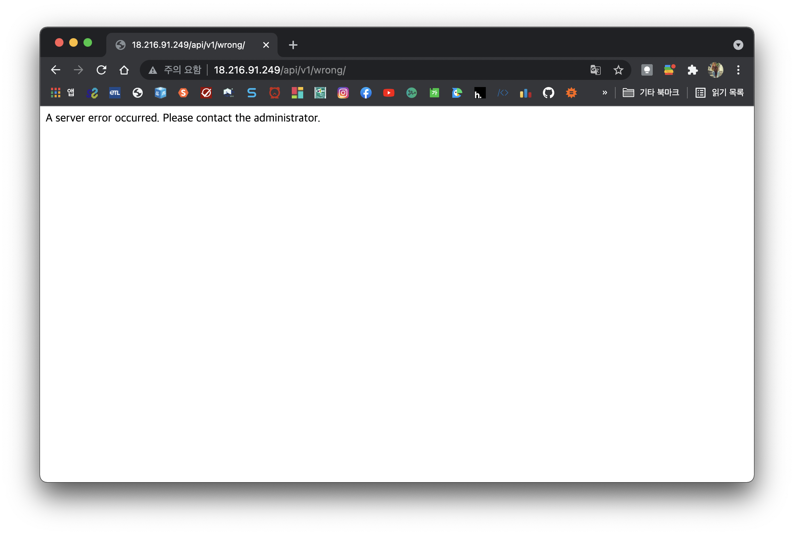

# waffle-rookies-19.5-backend-2

와플스튜디오 19.5기 루키 Django 세미나 5 [과제](https://github.com/wafflestudio/19.5-rookies/blob/master/django/seminar5/assignment.md)

---
### 500 Server Error API
`handler500`을 작성하여 `HttpResponse`로 에러 메시지를 반환하고 로그가 기록되도록 하였다.

---
### 드랍한 수강생 재등록
`reregister.ipynb` 스크립트 파일을 작성하였다.
