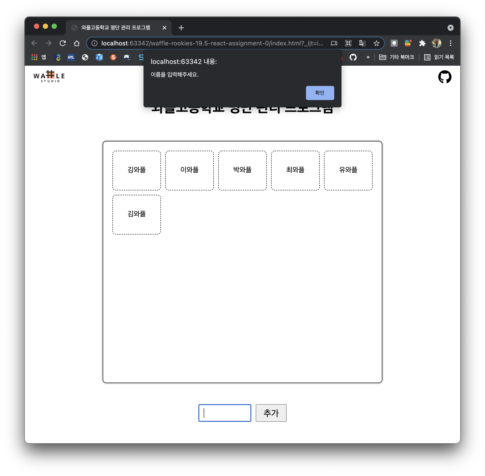

# React Assignment 0

와플스튜디오 19.5기 루키 React 세미나 0 [과제](https://github.com/wafflestudio/19.5-rookies/blob/master/react/seminar0/assignment.md)

* [`index.html`](./index.html) : HTML 실행 파일
* [`static`](./static) : CSS 및 JavaScript 파일
* [`src`](./src) : 웹사이트에 이용된 기타 이미지 파일

---
### 웹사이트 실행 모습 스크린샷

