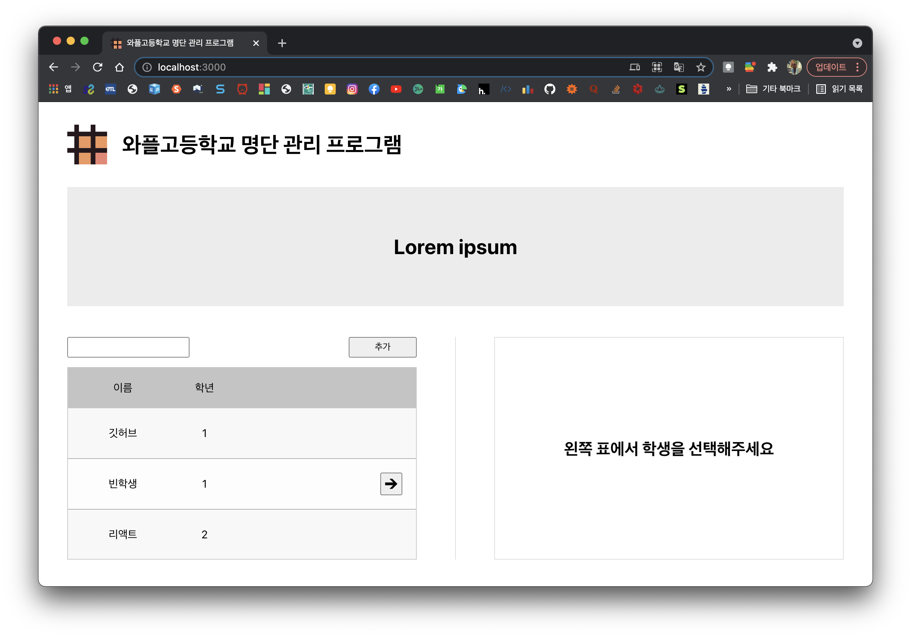
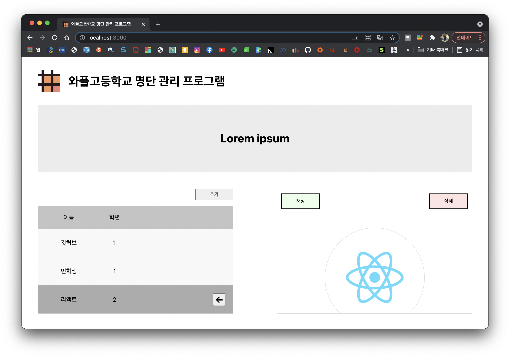
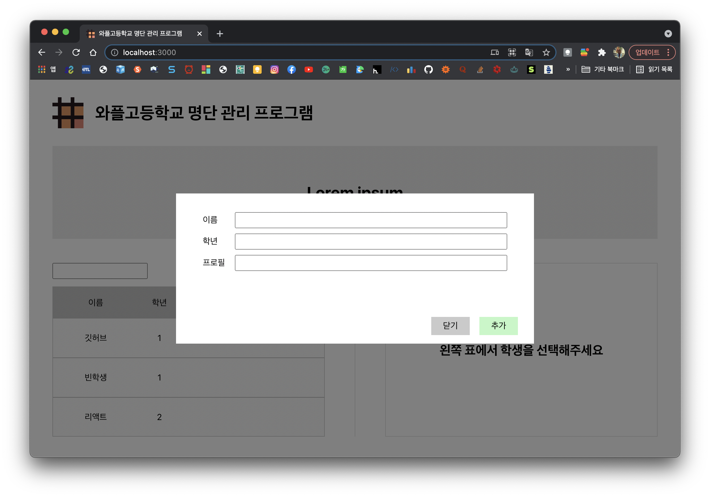
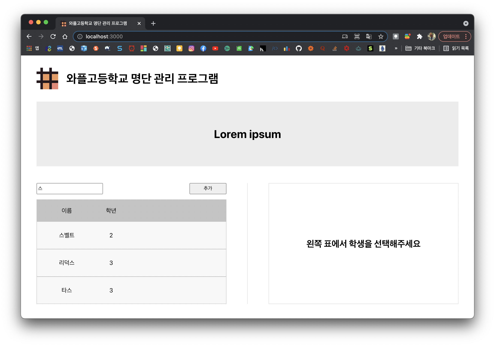

# waffle-rookies-19.5-react-assignment-1

와플스튜디오 19.5기 루키 React 세미나 1 [과제](https://github.com/wafflestudio/19.5-rookies/blob/master/react/seminar1/assignment.md)

* [`public`](./public) : `index.html` 및 웹사이트 Favicon 파일 
* [`src`](./src) : CSS 및 JavaScript 파일, component 별로 분류되어있음

---
### 아쉬운 점 😢

* CSS 복붙함
* 변수이름이 너무 제각각이고 PascalCase와 camelCase 사이를 왔다갔다함
* Component 분리를 이렇게 하는게 맞나...?
* 학생 삭제 기능 구현이 찝찝함,, 뭔가 key 값을 잘 활용하지 못한 것 같음 
* 코드가 전반적으로 더러움

청강생이기도 하고, 특히나 Backend 과제가 어려워서 React에 많은 시간을 투자하지 못했습니다...
하루 전날 과제를 시작하였는데, 코드 퀄리티는 좋지 않은 것 같고 시간도 늦었지만 다행히 완성은 했네요.
천천히 따라가면서 마무리하겠습니다!

---
### 웹사이트 실행 모습 스크린샷

